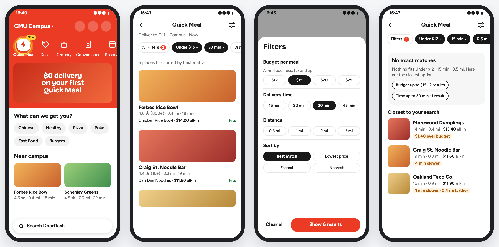
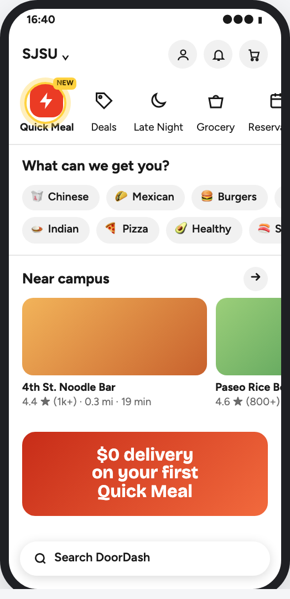
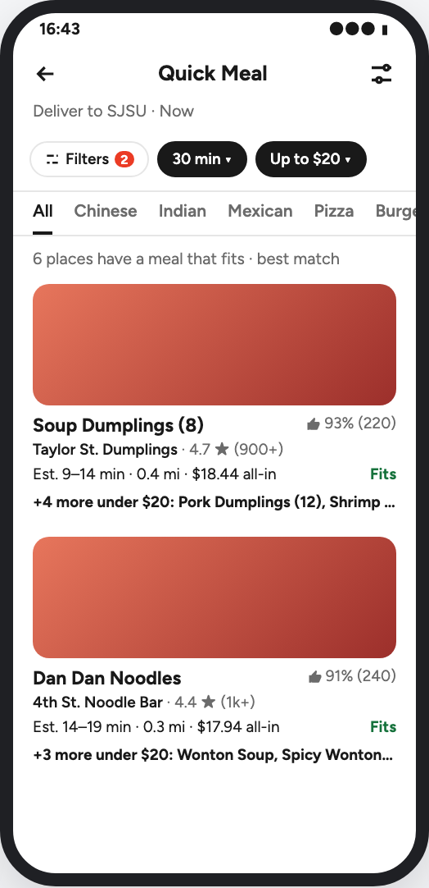
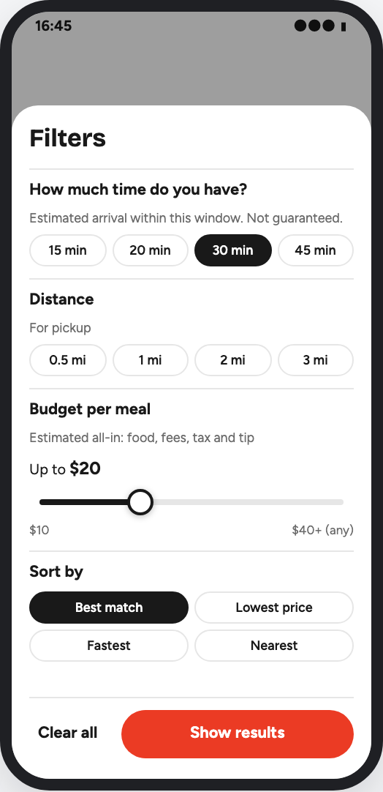
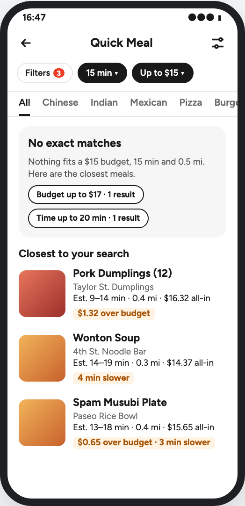
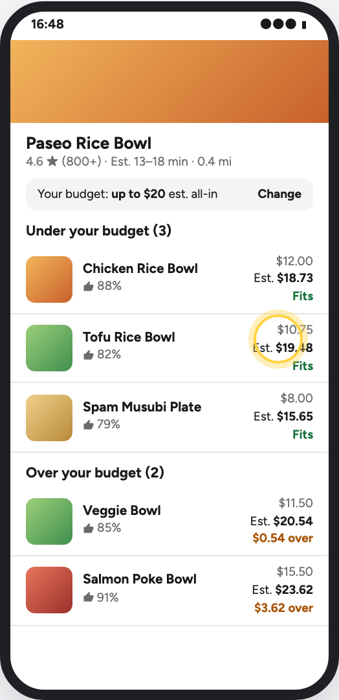
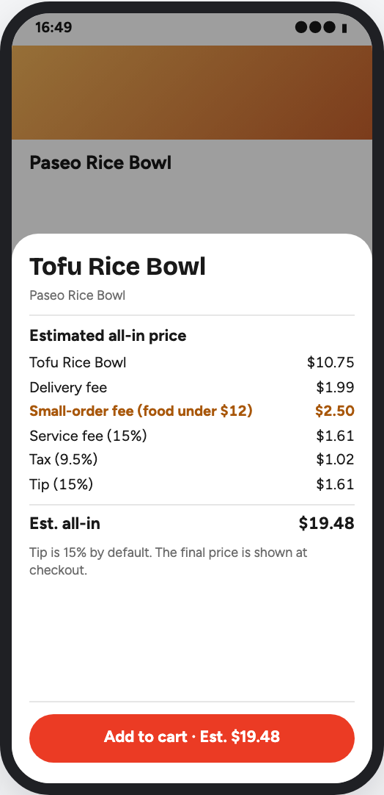

# How we built this with AI

This page is for students who want to build a prototype or MVP with an AI coding assistant. It uses this repo's real history. Every claim links to something you can open.

## What we built

Quick Meal is a concept feature for a food delivery app. It helps a busy student decide fast. The student says how much time they have, can add a budget, and sees one meal per place that fits, with an estimated time and an estimated all-in price.

Live demo: https://quick-meal-demo.ioenv.workers.dev

## Step 1: Polish the design with AI

We did not start with code. We started with a design page and argued about it.

### The first draft was rough

The PM's brief had three parts: an entry on the Home screen, a list with filters (budget, time, distance), and a sheet to set the filters. Plus one rule: say something useful when nothing fits.

From that, the AI drew version 1 in a few minutes:

It looked finished. It was not. The cards listed restaurants, not meals. Budget was four fixed buttons. There were no cuisine tabs, no menu and no price breakdown. The location was a campus our users do not live near.

### About 30 rounds in two hours

The design was one web page with phone mockups, product decisions and acceptance criteria. The AI republished it after every change, so the PM always looked at the latest version. Before any code was written, the page went through 26 versions in about two hours, driven by about 30 messages from the PM. These are the questions that shaped the product.

**Restaurants or meals?** Looking at a card, the PM saw the problem: a hungry student picks a dish, not a restaurant. So each card became one meal, with the dish photo and the dish's own rating (thumbs-up %), which is not the same as the restaurant's stars. We kept one meal per place, so the result count still means "places that fit".

**How do I see the other dishes?** The next question came straight from the new card. The answer is a line like "+2 more under $20: Tofu Rice Bowl, Spam Musubi Plate". It opens that restaurant's menu, split into "Under your budget" and "Over your budget". A dish only $0.54 over might still be wanted, so it stays visible with the amount. A later round removed the highlight on the tapped dish. The card's meal is simply first on the menu, because the list and the menu share one sort rule.

**A dish detail page?** The PM asked if we needed one. We chose one extra screen, the restaurant menu, and no dish page, cart or checkout. The menu answers "what else fits here?", which is the real question.

**Two campuses showed a hidden problem.** When the location moved from Pittsburgh to the Bay Area, the AI guessed that 0.5 mi around one campus has almost no restaurants. It did not check this. The guess still raised a real point: good distance steps depend on how dense the area is. So the rule is that the backend picks one of two step sets: 0.5, 1, 2, 3 mi for a dense area and 1, 2, 3, 5 mi for a suburb. The demo uses one dense location (San José State University) and one set. Showing two locations was rejected: it doubles the mock data and is not in the acceptance criteria.

**What does the price mean?** The budget is the estimated all-in price of one meal: food, fees, tax and tip.

- "All-in" won over "out-the-door". It is shorter and plainer.
- The PM said the total can never be exact. So cards say "Est. $18.73", and the breakdown is titled "Estimated all-in price".
- Tax became a per-restaurant rate. The demo uses one assumed rate.
- A small-order fee was added: $2.50 when the food is under $12.
- The PM doubted the 15% service fee. The AI looked it up on DoorDash's help page, which listed 15% in California, and labeled the row "no DashPass".
- The PM asked where the "tip is 15%" note appears. There was no screen for it. That question added screen 6, the price breakdown.

**Cuisine: filter or tabs?** Cuisine started as a filter, became single-select tabs, and then the filters moved above the tabs. DoorDash puts tabs on top, so we asked whether to follow it. We kept our order for two reasons. On DoorDash a tab picks the store type, which decides which filters apply. Here the filters decide what fits and the tabs only split it. And filters under the tabs would look like they reset when the tab changes.

**Fewer API routes.** The PM removed an "options" route the page did not need, and asked whether a new restaurant route could clash with the app's own API. Everything new now lives under `/api/quick-meal/`.

**Who is it for?** An early draft said our users were students at one Pittsburgh campus. The PM corrected it: Bay Area students, and any US student. Prices, the budget range, distance steps and street names were all redone for the new location.

**How do we know it works?** The AI first proposed a user-test plan. The PM pasted the course's validation format, and the AI rewrote it as seven acceptance criteria (AC-01 to AC-07), each tied to a screen. The PM also split the decisions into product decisions (P1 to P8, true in any city) and demo decisions (D1 to D5, only for this demo).

**Smaller rules.** Budget became a slider, because students have a number in mind and it is often not round. Time and distance are separate filters, and both apply. Applied filters are saved as the user's default, but a one-tap "relax" is not. Real DoorDash data was ruled out after reading the terms of use, so the data is invented. Money is computed in whole cents.

### The final six screens

<table>
  <tr>
    <td align="center"> 1 Home</td>
    <td align="center"> 2 Meal list</td>
    <td align="center"> 3 Filters sheet</td>
  </tr>
  <tr>
    <td align="center"> 4 No match</td>
    <td align="center"> 5 Menu in budget view</td>
    <td align="center"> 6 Price breakdown</td>
  </tr>
</table>

The whole page is in [docs/design.html](design.html). GitHub shows it as code, so open the [live design page](https://quick-meal-demo.ioenv.workers.dev/design) or the image [docs/design.png](design.png).

### Why talk over a picture

Most of the questions above came from looking at a screen, not from reading a spec.

- "How do I see other dishes?" only comes up once a card shows one dish.
- The PM noticed that screen 6 showed the Tofu Rice Bowl while screen 5 marked the Chicken Rice Bowl. Two sentences in a text spec would never clash so visibly.
- "Do the filters reset when I change tabs?" is a question about where things sit on the screen.

A text brief of three parts reads as complete. A drawing shows what is missing.

### Who did what

- **The PM** asked questions from the student's seat, caught clashes between screens, and made every product call.
- **The AI** drew each version in minutes, offered options with a recommendation, looked up facts (the terms of use, the fee page), recomputed every price, and kept the page consistent.
- **The AI also made mistakes.** It guessed about restaurant density without checking. It forgot the breakdown screen until the PM asked. Two scenario counts on the page were wrong until a script checked them against the data (see below).

The AI was fast at drafting. People decided.

## Step 2: Turn the design into refined issues

Next, the AI split the design into one epic, [#1](https://github.com/githonllc/quick-meal-demo/issues/1), and 13 sub-issues, #2 to #14. The epic holds the shared contract (types, constants, pricing formula, API) so every issue builds on the same definitions.

Each sub-issue has an **Implementation Refinement** section. It is written so a model can build the issue without guessing:

- **Location**: the files to create or change.
- **Key invariants**: the rules that must stay true, with the reason.
- **Exact changes**: numbered steps, including rejected options and why they were rejected.
- **Implementation constraints**: branch name, no new dependencies, what belongs to other issues.
- **Acceptance criteria (command level)**: commands and test cases, not prose.
- **Non-goals**: tempting extras, and which issue owns them.
- **Execution Tier**: `sonnet` for well-pinned work, `opus` where judgment is needed.

See [#4](https://github.com/githonllc/quick-meal-demo/issues/4) (the search engine) for a full example.

## Step 3: Build issue by issue

One issue, one branch, one pull request. The main AI session acted as an orchestrator. It handed each issue to a separate AI agent, then checked the work itself before merging.

- **Tests first for logic.** For #3 to #6 the first commit holds only failing tests, and the second makes them pass. For example, commit `2c7bea5` adds the pricing tests and `2f34a38` adds the code ([PR #16](https://github.com/githonllc/quick-meal-demo/pull/16)).
- **A Playwright test for every acceptance criterion.** AC-01 to AC-07 each map to an e2e test (see [docs/validation.md](validation.md)).
- **The orchestrator re-ran everything.** Before each merge it ran lint, typecheck, unit tests, build and e2e on its own, and looked at screenshots. An agent's "all green" was never taken on trust.
- **Rebase merges only.** The history reads as one line, one commit per step.

Good PRs to read: [#17](https://github.com/githonllc/quick-meal-demo/pull/17) (search engine), [#18](https://github.com/githonllc/quick-meal-demo/pull/18) (mock data tuned to the demo script), [#23](https://github.com/githonllc/quick-meal-demo/pull/23) (filter sheets and saved default).

PRs #15 to #27 were all merged on 2026-09-30. `git log` shows the times.

## Step 4: Validate

[#13](https://github.com/githonllc/quick-meal-demo/issues/13) deployed the app as one Cloudflare Worker and ran the full e2e suite against the live URL. [docs/validation.md](validation.md) lists each acceptance criterion, its result and the test that checks it, with five screenshots.

## Step 5: Use it on a real phone

All acceptance criteria passed. Then the PM used the live demo on a phone and found five problems that no test had caught.

1. **Home cuisine chips opened Quick Meal.** The design said so: tap "Chinese" and Quick Meal opens on the Chinese tab. In use, the PM expected the normal category page. These chips and the "Near campus" cards now show a "not in this demo" note ([#30](https://github.com/githonllc/quick-meal-demo/issues/30)).
2. **The menu's "Change" shows only the budget.** This one is by design. Time and distance belong to a restaurant, not to a dish, so only budget and sort change a menu. No change.
3. **The page behind a sheet scrolled.** Dragging inside a filter sheet also scrolled the list behind it. The page now locks while a sheet is open ([#31](https://github.com/githonllc/quick-meal-demo/issues/31)).
4. **Lists felt slow.** Part of it was ours: the Worker waited 0.3 seconds on purpose so the loading state would show in a demo. The delay is gone, photos and scripts are cached, and the list stays on screen with a thin loading bar while new results load ([#32](https://github.com/githonllc/quick-meal-demo/issues/32)). The "2 seconds blank" the PM saw was not reproduced in our tests.
5. **"Show 0 results" that then shows meals.** Since version 1, the sheet's button showed a live count, like "Show 6 results". That needs a request on every change, and on a slow network the number can be out of date. We dropped it. The button now says "Show results" and the search runs only when the user applies ([#36](https://github.com/githonllc/quick-meal-demo/issues/36)).

Two of these undid design decisions. The live count was in the design from the first draft and in AC-03. It looked right in a mockup and felt wrong on a phone. The design page was updated to version 29 to match ([#37](https://github.com/githonllc/quick-meal-demo/issues/37)).

Installing the demo on an iPhone Home Screen ([#42](https://github.com/githonllc/quick-meal-demo/issues/42)) showed one more thing. The white status bar faded into Home's red header. The current DoorDash Home has a white top, so we matched it instead of patching the status bar ([#44](https://github.com/githonllc/quick-meal-demo/issues/44)). The design page went to version 30.

### A third round: the team checks the concept

Then the team compared the demo with our concept slides and worksheet. Two problems came out.

- **An outdated concept name.** The design page said the demo served "Budget-First Ordering". That name came from an early draft. The team's final concept is Busy Mode, aimed at value, predictability and lower decision effort. The AI had built on the old draft, and a teammate caught it by checking the team's own slides.
- **Two ideas of time.** We had drifted between decision time (how fast a student picks a meal) and delivery time (when the food arrives). Our TA had asked how we could guarantee a delivery time and what happens when an order is late. There is no simple answer. The team settled it in a chat thread: decision time is the north star, and delivery time is an estimate and a guardrail, not a promise.

The design changed to match (version 34, [#47](https://github.com/githonllc/quick-meal-demo/issues/47)). Time comes first. Every time shows as a range like "Est. 9–14 min", so it reads as an estimate. Nothing on the card is bold, because a bold time would read like a promise. Distance moved into the Filters sheet, labeled for pickup, since only the student knows whether they will walk, bike or drive.

The lesson: an AI keeps every earlier choice in the page, including outdated ones. Check its premises against the team's latest documents.

The lesson: a mockup catches what is missing, and a real phone catches how it feels. You need both.

## What went wrong and what we changed

The AI made mistakes. So did the design. Most were caught by a check, not by luck.

- **Design numbers the data could not meet.** While writing the issues, a quick script checked the design's scenario counts against the restaurants it named, and some did not fit. We fixed the targets before any code.
- **Float rounding.** Computed in dollars, 15% of $11.50 is `1.7249999…`, and `toFixed(2)` shows $1.72, not $1.73. That would have shown "$0.52 over" instead of the design's "$0.54 over". All money is integer cents with half-up rounding ([#3](https://github.com/githonllc/quick-meal-demo/issues/3)).
- **A tie that would break the demo.** In the no-match scenario, a $17.00 dumpling total would score exactly like a nearby noodle bar, and the tie-break would put the wrong place first. The data test pins the total to $16.01 to $16.99 ([PR #18](https://github.com/githonllc/quick-meal-demo/pull/18)).
- **The mockup broke its own rule.** Once real data ran, the meal list put a dish at 91% likes above one at 88%. Version 26 of the design showed the opposite order, which broke its "best match" rule. The code was right, so we fixed the design ([PR #20](https://github.com/githonllc/quick-meal-demo/pull/20)).
- **A hidden folder.** A global git ignore rule for `data/` hid `worker/data/`, so the mock data would not have been committed. The repo's `.gitignore` now keeps it ([PR #18](https://github.com/githonllc/quick-meal-demo/pull/18)).
- **Two agents, one port.** Two agents ran e2e tests at the same time on the same port, and one run failed. The code was fine. Run parallel test servers on different ports.
- **Right after deploy.** The first e2e run against production started seconds after the first deploy and had 6 failures. Two runs a minute later passed 24 of 24. Wait a minute after a first deploy before you test it.
- **Small review catches.** On the menu page, the reused budget sheet said "Show N results", which counted places, not dishes. It now says "Apply" ([PR #25](https://github.com/githonllc/quick-meal-demo/pull/25)). The first "bowl" photo was a fruit acai bowl, shown next to a chicken rice bowl. It was swapped ([PR #26](https://github.com/githonllc/quick-meal-demo/pull/26)).

## Tips for your own MVP

1. **Design before code.** A design page with decisions and acceptance criteria is cheap to change. Code is not.
2. **Argue over pictures, not text.** Ask the AI to draw the screens, then ask questions as a user. Most good questions come from looking at a screen.
3. **Write acceptance criteria as numbers.** "Shows 6 results" can be tested. "Works well" cannot.
4. **Make the mock data serve the demo.** Hand-tune it to your demo script, and lock the counts with tests so an edit cannot break the live demo.
5. **Give the AI small, exact tasks.** One issue with files, rules and test cases beats one big request.
6. **Check, do not trust.** Re-run the tests yourself and look at the screen. Then use it on a real phone. An AI report of success is a claim, not proof.
7. **Keep a human on every decision.** Let the AI propose and draft. People choose what the product does.
8. **Write down what went wrong.** It is the most useful part for the next team.
