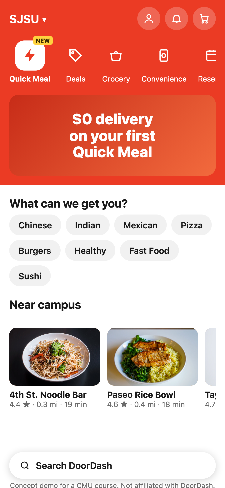
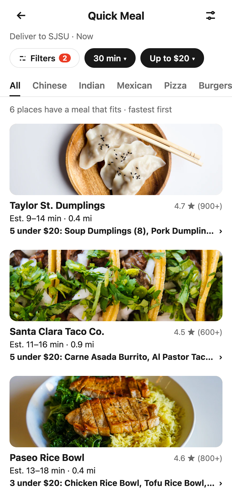
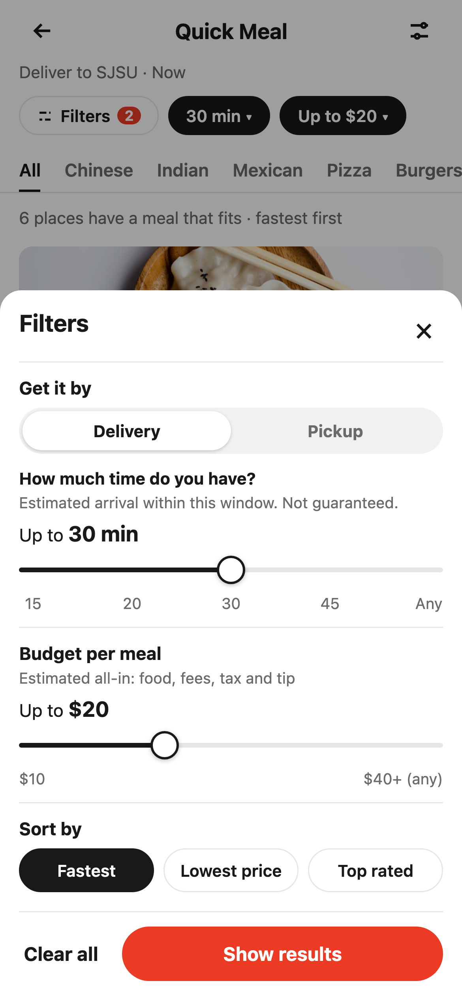
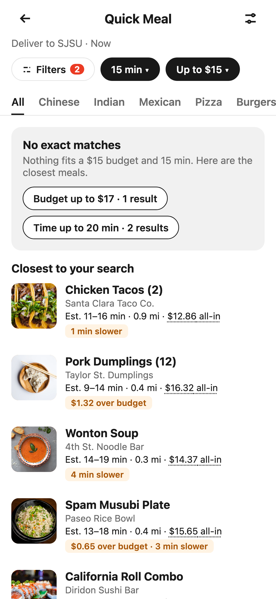
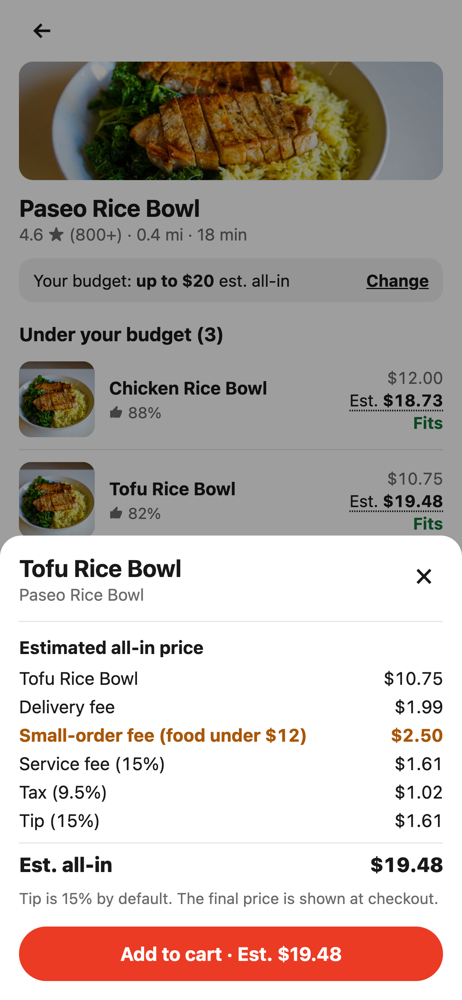
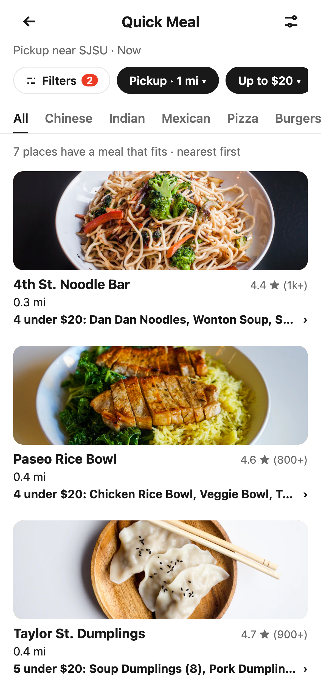

# Validation

This branch (`restaurant-cards`) is the restaurant-cards variant, design version 37. It runs on its own Worker. The main demo and its validation stay on `main`.

- Date: 2026-10-02
- Live URL: https://quick-meal-demo-cards.ioenv.workers.dev
- Deployed commit: `403dd88`
- Worker version: `79286579-58e9-4239-8d57-ba31e668f7b7`
- Main demo (not changed): https://quick-meal-demo.ioenv.workers.dev, commit `b3d6374`

Every acceptance criterion from the "Validation" section of [design.html](design.html) (version 37) was run as an automated Playwright test against the live variant URL.

## Results

| ID | Feature | Result | Note |
|---|---|---|---|
| AC-01 | **Quick Meal entry.** Given the Home screen, when the user taps Quick Meal in the category row, then the Quick Meal screen opens with the chip row (Filters, Time, Budget), the cuisine tabs below it (All selected) and a list of restaurant cards, with no Restaurant or Grocery tabs. | Pass | `e2e/list.spec.ts`: "AC-01: Home opens Quick Meal with chips, tabs and meal cards" |
| AC-02 | **All-in budget.** Given a budget of $20, when results load, then every card's dish line counts only meals with an estimated all-in price of $20.00 or less, every "Under your budget" row on its menu is $20.00 or less, and the breakdown behind any price (item, delivery fee, small-order fee, service fee, tax, tip) adds up to that price to the cent, and the small-order fee appears only when the item costs less than $12. | Pass | `e2e/list.spec.ts`: "AC-02: every card counts only meals that fit, and each menu breakdown adds up" |
| AC-03 | **Filters sheet.** Given the Filters sheet, opened from either the top-right icon or the Filters chip, when the user sets the time to 30 min and the budget to $20, then the time group comes first and asks "How much time do you have?", the button reads "Show results", and after applying the list shows 6 restaurant cards, the chips read "30 min" and "Up to $20", and the Filters badge shows 2. | Pass | `e2e/filters.spec.ts`: "AC-03: the Filters sheet opens from the chip and the top-right icon" |
| AC-04 | **Combined filters.** Given budget $20 and time 20 min are on, when the user taps the Chinese tab, then every card is a Chinese place that passes both filters, and the count (2) is lower than on the All tab (4). | Pass | `e2e/list.spec.ts`: "AC-04: a cuisine tab splits the filtered meals and keeps the chips" |
| AC-05 | **No match and relax.** Given budget $15 and time 15 min, when results load, then the screen shows "No exact matches", up to 5 closest meals each labeled with how it misses (for example "1 min slower" or "$1.32 over budget"), and relax chips with result counts. When the user taps "Budget up to $17 · 1 result", the list shows exactly 1 meal and the slider moves to $17, while the saved default budget stays at $15. | Pass | `e2e/no-match.spec.ts`: "AC-05: no exact match shows the message, relax chips and near cards", "a relax chip loosens the view" and "a relax chip does not change the saved default" |
| AC-06 | **Menu in budget view.** Given a budget of $20, when the user taps the Paseo Rice Bowl card's dish line, "3 under $20: Chicken Rice Bowl, Tofu Rice Bowl, …", then the menu opens with "Under your budget (3)" listing the Chicken Rice Bowl first (the first meal on the card), then the Tofu Rice Bowl and Spam Musubi Plate, and the Veggie Bowl shows "$0.54 over". | Pass | `e2e/menu.spec.ts`: "AC-06: the menu shows what fits first, then what is just over" |
| AC-07 | **Saved default.** Given the user applied budget $20 and time 30 min and is on the Chinese tab, when they leave Quick Meal and come back, including after closing the browser tab, then budget $20 and time 30 min are on, the All tab is selected, and the 6 restaurant cards for $20 · 30 min show. | Pass | `e2e/filters.spec.ts`: "AC-07: applied filters come back next visit, the cuisine tab does not" |
| AC-08 | **Estimated times.** Given time 30 min and budget $20, when results load, then every card shows one line like "Est. 9–14 min · 0.4 mi", with the time as a range before the distance, the slow end of every range is 30 min or less, no card shows a price, nothing in that line is bold, and the time group in the Filters sheet says "Not guaranteed." | Pass | `e2e/list.spec.ts`: "AC-08: times are estimated ranges and cards show no price" |
| AC-09 | **Delivery or pickup.** Given budget $20 and time 30 min, when the user opens the Filters sheet and taps Pickup, then the time slider is replaced by a distance slider (0.5 · 1 · 2 · 3 mi · Any) set to Any, and there is no "For pickup" text. When the user slides to 1 mi and taps "Show results", the chip reads "Pickup · 1 mi", the URL has `distance=1` and no `time`, the Filters badge shows 2, the sort is Nearest, and the list shows 7 restaurant cards. Every card shows a line like "0.4 mi" with no time and no price. On the Paseo Rice Bowl menu, opened from its card, the Chicken Rice Bowl breakdown has no delivery fee line and adds up to $16.74. | Pass | `e2e/filters.spec.ts`: "AC-09: Pickup swaps time for distance and drops the delivery fee" |

First deploy (`96522f6`): we ran the full suite three times. The first run started seconds after the deploy and had 6 failures (the first API call got a 404), most likely because the new Worker had not yet reached every edge location. Runs 2 and 3, a minute later, both passed 24 of 24.

After the real-phone walkthrough fixes, the Home Screen install and the white Home (`67ee67f`): 29 tests ran against the live URL and all passed.

After the time-first change (`0cdc1bc`): 30 tests ran against the live URL and all passed, including AC-08. The 5 screenshot tests are skipped in a normal run.

After design version 35 (`95ba02f`: Delivery | Pickup, pickup prices without the delivery fee, visible sorts): 36 tests ran against the live URL and all passed, including the new AC-09. The 6 screenshot tests are skipped in a normal run; they were then run on purpose and all 6 shots were saved.

After the follow-ups (`629eae8`: "Pickup near SJSU" and swapping Fastest and Nearest; `159875f`: no Nearest in Delivery, and no flash when going back from a menu): 38 tests ran against the live URL and all passed. The new back-navigation test checks for no skeleton, no loading bar and no dish name over a photo. Shots 3 and 6 were saved again.

After design version 36 (`b3d6374`: time and distance set with a slider, and a "Show results" button in the Time chip's sheet): 40 tests ran against the live URL and all passed, including AC-03, AC-07 and AC-09 with the slider. Shot 3 was saved again.

Variant: restaurant cards (`7214fb9`, Worker `quick-meal-demo-cards`): 42 tests ran against the variant URL and all passed. The main demo was run again at the same time: 40 of 40 passed, so it did not change. The screenshots then showed that a long dish line pushed the card and its rating off screen. `403dd88` fixes this, and a new check in the card test failed on `7214fb9` and passes on `403dd88`. After that deploy, 42 tests ran against the variant URL and all passed. Shots 2, 3 and 6 were saved again.

## How to re-run

Run all e2e tests against the live demo:

```sh
BASE_URL=https://quick-meal-demo-cards.ioenv.workers.dev npm run e2e
```

Save the screenshots below again (they are skipped in a normal run):

```sh
SCREENSHOTS=1 BASE_URL=https://quick-meal-demo-cards.ioenv.workers.dev npx playwright test e2e/screenshots.spec.ts
```

## Screenshots

All shots are 390x844 at 3x, taken from the live URL.

**1. Home.** Must-have feature: Quick Meal entry.



**2. Quick Meal list at 30 min and $20.** Must-have features: restaurant cards with estimated times and the meals that fit, cuisine tabs and chip row (time first). Also saved default (these are the filters that come back next visit).



**3. Filters sheet.** Must-have feature: Filters sheet. Also saved default (applying saves the filters).



**4. No match at $15 and 15 min.** Must-have feature: no-match results with relax chips.



**5. Paseo Rice Bowl menu at $20 with the Tofu Rice Bowl breakdown.** Must-have features: menu in budget view and price breakdown.



**6. Pickup within 1 mi at $20.** Must-have feature: Filters sheet with the Delivery | Pickup switch (AC-09). Cards show the distance only: no time and no price. Menu prices have no delivery fee.



## Manual walkthrough

The PM walked through the live demo on a real phone after all the tests passed. Each finding and what we did:

1. Home cuisine chips and "Near campus" cards opened Quick Meal. They should open the normal pages, which are not in this demo. They now show a "not in this demo" note ([#30](https://github.com/githonllc/quick-meal-demo/issues/30)).
2. On a menu, "Change" shows only the budget, not time or distance. By design: time and distance belong to a restaurant, so only budget and sort change a menu. No change.
3. Dragging inside a filter sheet also scrolled the page behind it. The page now locks while a sheet is open ([#31](https://github.com/githonllc/quick-meal-demo/issues/31)). Still to check by hand on iOS and Android.
4. Long lists felt slow to load. The 0.3 second demo delay was removed, photos and scripts are cached, and the list stays on screen with a loading bar while new results load ([#32](https://github.com/githonllc/quick-meal-demo/issues/32)).
5. The live count on the sheet ("Show N results") could be out of date on a slow network. It was removed. The button says "Show results" and the search runs only on apply ([#36](https://github.com/githonllc/quick-meal-demo/issues/36)). The design page was updated to match ([#37](https://github.com/githonllc/quick-meal-demo/issues/37)).
6. Installed on an iPhone Home Screen ([#42](https://github.com/githonllc/quick-meal-demo/issues/42)), the white status bar faded into Home's red header. Home is now white like the current DoorDash app ([#44](https://github.com/githonllc/quick-meal-demo/issues/44)). Still to check by hand on an iPhone and an Android phone.
7. The team reviewed the demo against our concept slides and worksheet. The design still said "Budget-First Ordering", an outdated name, and mixed up decision time with delivery time. Now time comes first, every time is an estimated range, nothing on the card is bold, and distance is in the Filters sheet for pickup ([#47](https://github.com/githonllc/quick-meal-demo/issues/47)). Whether students read "How much time do you have?" as order-to-door time is left for a later user study.
8. A second team review (design version 35): time and distance answer one question, so they became one Delivery | Pickup switch. Pickup cards show no time and their price has no delivery fee. "Best match" was removed because no one could see how it ranked. Times stay in minutes, because a clock time would slip while the student browses before ordering. Ranking by personal taste needs a user profile, so it is out of the demo's scope. The page has no subtitle, to match DoorDash; a first-visit hint explains Quick Meal instead.
